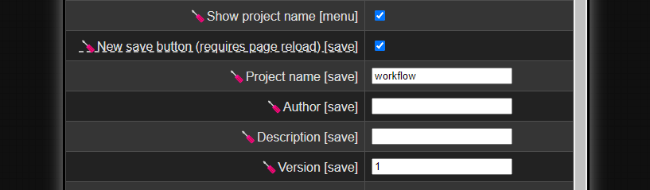
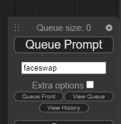
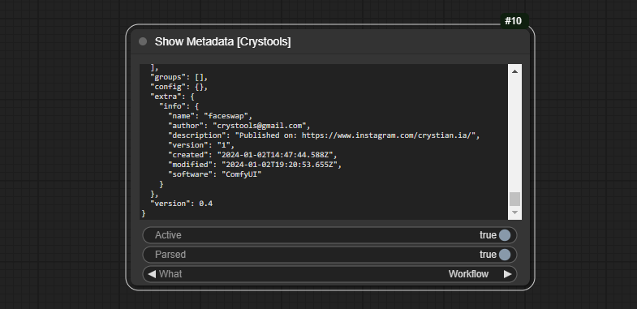

# ComfyUI-Crystools-save [](https://hits.seeyoufarm.com) [](https://paypal.me/crystian77)

🪛 **_You can save your workflows with a particular file name (finally!), and save author info as metadata_** 🪛

With this quality of life extension, you can save your workflow with a specific name and include additional details such as the author, a description, and the version (in metadata/json).
**Important:** When you share your workflow (via png/json), others will be able to see your information!

It works transparently; you can load/import the information in the traditional way.

## Settings

 
* `Use new save button?`: I've to change the default behavior of the "save" button. Now it saves the workflow with the name of the project, may you don't want this, so you can turn off this feature.
* `Show project name in menu`: Show the project name in the menu (see below).
* `Project name`: The name of the project, it will be used to save the workflow and file name.
* `Author`: The author of the project.
* `Description`: A description of the project.
* `Version`: The version of the project.

## Menu


You can turn on/off the project name in the menu (see settings).

## Metadata

If you want to see the metadata, you can use the "[Crystools](https://github.com/crystian/ComfyUI-Crystools)" extension with a "Show metadata" node, ensure you select the "workflow" option.




## Important notes

* I used a specific field in metadata/json: "workflow.extra." I've created an "info" property to store this information. I don't know, and I haven't found any documentation about this, so I hope it's not a problem.

## Changelog

Because it is the same project for me, I will use the same changelog on that project [ComfyUI-Crystools](https://github.com/crystian/ComfyUI-Crystools?tab=readme-ov-file#changelog).

## Installation

### Install from GitHub
1. Install [ComfyUi](https://github.com/comfyanonymous/ComfyUI).
2. Clone this repo into `custom_modules`:
    ```
    cd ComfyUI/custom_nodes
    git clone https://github.com/crystian/ComfyUI-Crystools-save.git
    ```
3. Start up ComfyUI.

### Install from manager

Search for `crystools` in the [manager](https://github.com/ltdrdata/ComfyUI-Manager.git) and install it.

---

Made with ❤️ by Crystian.
